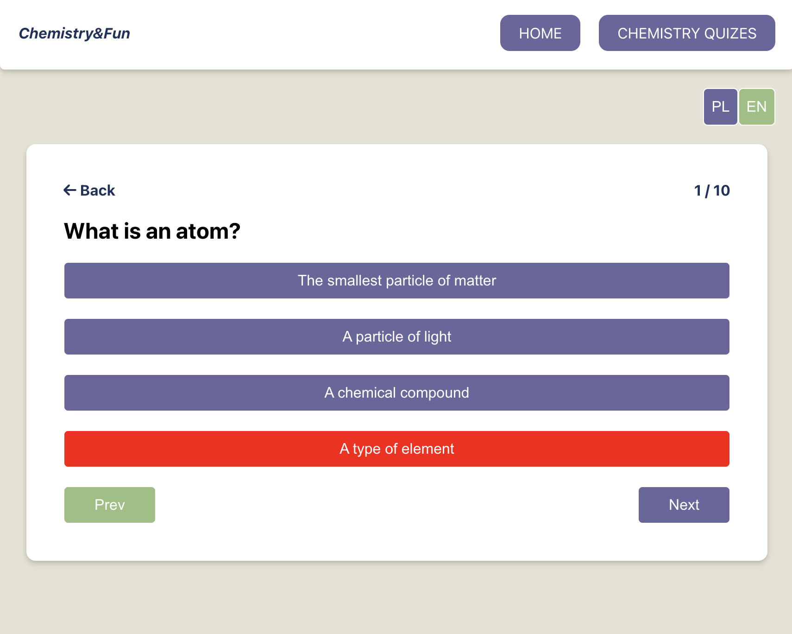

# chemistry&fun

Chemistry&Fun is a website where you can learn chemistry in an engaging and enjoyable way. Here, you'll find chemistry quizzes and more! The content and functionalities are constantly being expanded — the next planned feature is a calculator. The website is available in both English and Polish.

\*website is still in progress

## Features

Interactive chemistry quizzes.
Support for English and Polish languages.
Responsive design for optimal viewing on various devices.
Regular updates with new content and features.

## Live DEMO:

https://chemistryandfun-8099e.web.app/

## Tech Stack

-   React (including React Router, Context API, and Hooks: useState, useEffect, useNavigate, useLocation, useParams, etc.)
-   CSS for styling.
-   Parallax scrolling effect.
-   Responsive Web Design (RWD) to ensure usability across different screen sizes.
-   Bilingual support: Polish and English.

## Demo:

## MIT License:

Copyright © 2024 Karolina Rachuta. All rights reserved.
